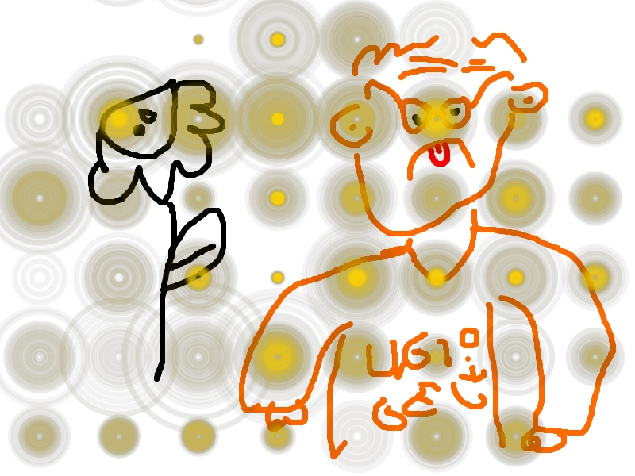

<title>sas</title>

# sus vala

> il migior sito mai visto e
> mai creato

* 	Red
*   Green
*   Blue

## il codide

```
che guardi 
if sus == sas:
print("lel")
```

[This link](http://example.net/)

[blog](pages/BLOG/blog1.html)
alora abbiamo fatto `centro`



## qweqwe